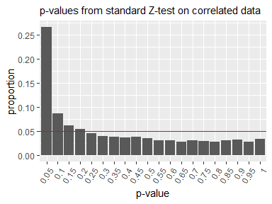

<!-- README.md is generated from README.Rmd. Please edit that file -->

```{r setup, include = FALSE}
knitr::opts_chunk$set(
  collapse = TRUE,
  comment = "#>",
  fig.path = "man/figures/README-",
  out.width = 600,
  message = FALSE
)
```

# deltatest: Statistical Hypothesis Testing Using the Delta Method for Online A/B Testing

<!-- badges: start -->
[](https://github.com/hoxo-m/deltatest/actions/workflows/R-CMD-check.yaml)
<!-- badges: end -->

## 1. Overview

In online A/B testing, we often face a significant practical challenge: the randomization unit differs from the analysis unit. In practice, control and treatment groups are typically assigned at the user level, while metrics—such as click-through rate—are generally measured at a finer level (e.g., per page view). In this scenario, the randomization unit is the user, while the analysis unit is the page view.

This discrepancy raises concerns when performing statistical hypothesis testing, which relies on the assumption that data points are independent and identically distributed (i.i.d.). Specifically, a single user can generate multiple page views, and each user may have a different probability of clicking. As a result, the data could be correlated within users, thereby violating the i.i.d. assumption.

To address this issue, Deng et al. (2018) proposed a statistical hypothesis testing method using the Delta method. This package has been developed to make it easy to execute that method.

First, we prepare a data frame that includes the number of clicks and page views aggregated for each user. This data frame also contains a column indicating whether each user was assigned to the control or treatment group.

```{r prepare_data}
library(dplyr)

n_user <- 2000

set.seed(314)
data <- deltatest::generate_dummy_data(n_user) |> 
  mutate(group = if_else(group == 0, "control", "treatment")) |>
  group_by(user_id, group) |> 
  summarise(clicks = sum(metric), pageviews = n(), .groups = "drop")
data
```

To perform a statistical hypothesis test using the Delta method on this data, as follows:

```{r execute}
library(deltatest)

deltatest(data, clicks / pageviews, by = group)
```

When applied to data with within-user correlation, the standard Z-test yields p-values that deviate from the uniform distribution expected under the null hypothesis. In contrast, the Z-test using the Delta method produces p-values that conform to this expected uniform distribution.




## 2. Installation

You can install the development version of deltatest from [GitHub](https://github.com/) with:

``` r
# install.packages("remotes")
remotes::install_github("hoxo-m/deltatest")
```

## Example


## Related Work

- [tidydelta: Estimation of Standard Errors using Delta Method](https://cran.r-project.org/package=tidydelta)

## References

- Deng, A., Knoblich, U., & Lu, J. (2018). Applying the Delta Method in Metric
Analytics: A Practical Guide with Novel Ideas. *Proceedings of the 24th ACM
SIGKDD International Conference on Knowledge Discovery & Data Mining.*
[doi:10.1145/3219819.3219919](https://doi.org/10.1145/3219819.3219919)
- Deng, A., Lu, J., & Litz, J. (2017). Trustworthy Analysis of Online A/B Tests:
Pitfalls, challenges and solutions. *Proceedings of the Tenth ACM International
Conference on Web Search and Data Mining.*
[doi:10.1145/3018661.3018677](https://doi.org/10.1145/3018661.3018677)
- id:sz_dr (2018). Calculating the mean and variance of the ratio of random
variables using the Delta method [in Japanese]. *If you are human, think more
now.* https://www.szdrblog.info/entry/2018/11/18/154952
