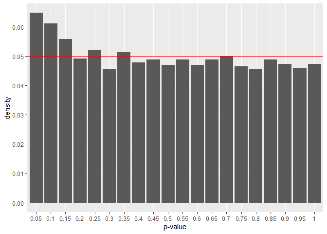
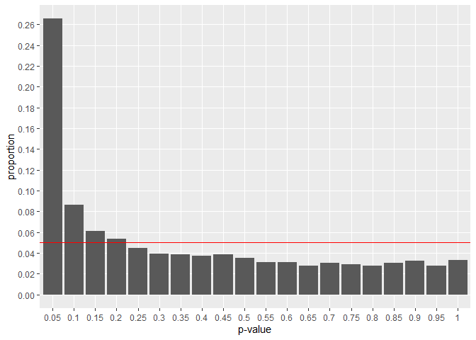

<!-- README.md is generated from README.Rmd. Please edit that file -->

# deltatest

<!-- badges: start -->

<!-- badges: end -->

## Installation

You can install the development version of deltatest from
[GitHub](https://github.com/) with:

``` r
# install.packages("remotes")
remotes::install_github("hoxo-m/deltatest")
```

## Example

``` r
library(deltatest)

n_user <- 2000

set.seed(314)
df_c <- generate_dummy_data(n_user)
df_t <- generate_dummy_data(n_user)

deltatest(df_c$click, df_c$view, df_t$click, df_t$view)
#> 
#>  Two Sample z-test with Delta Method
#> 
#> data:  (df_c$click, df_c$view) and (df_t$click, df_t$view)
#> z = -0.73363, p-value = 0.4632
#> alternative hypothesis: true difference in means between control and treatment is not equal to 0
#> 95 percent confidence interval:
#>  -0.014773163  0.006725915
#> sample estimates:
#>   mean in control mean in treatment        difference 
#>       0.043317663       0.039294039      -0.004023624
```

``` r
set.seed(314)

p_values <- NULL
for (i in 1:5000) {
  df_c <- generate_dummy_data(n_user)
  df_t <- generate_dummy_data(n_user)
  
  x <- rbind(colSums(df_c), colSums(df_t)) |> data.frame()
  result <- prop.test(x$click, x$view, correct = FALSE)
  
  p_values[i] <- result$p.value
}

library(ggplot2)
library(dplyr)
df <- data.frame(p_value = p_values) |>
  mutate(range = cut(p_value, breaks = seq(0, 1, by = 0.05))) |>
  group_by(range) |>
  summarise(p = factor(ceiling(max(p_value) * 20) / 20), n = n()) |>
  mutate(prop = n / sum(n))
ggplot(df, aes(p, prop)) +
  geom_col() +
  geom_hline(yintercept = 0.05, color = "red") +
  scale_y_continuous(breaks = seq(0, 1, by = 0.01), minor_breaks = NULL) +
  xlab("p-value") + ylab("proportion")
```



``` r
set.seed(314)

p_values <- NULL
for (i in 1:5000) {
  df_c <- generate_dummy_data(n_user)
  df_t <- generate_dummy_data(n_user)
  
  result <- deltatest(df_c$click, df_c$view, df_t$click, df_t$view)
  
  p_values[i] <- result$p.value
}

library(ggplot2)
library(dplyr)
df <- data.frame(p_value = p_values) |>
  mutate(range = cut(p_value, breaks = seq(0, 1, by = 0.05))) |>
  group_by(range) |>
  summarise(p = factor(ceiling(max(p_value) * 20) / 20), n = n()) |>
  mutate(prop = n / sum(n))
ggplot(df, aes(p, prop)) +
  geom_col() +
  geom_hline(yintercept = 0.05, color = "red") +
  scale_y_continuous(breaks = seq(0, 1, by = 0.01), minor_breaks = NULL) +
  xlab("p-value") + ylab("proportion")
```


