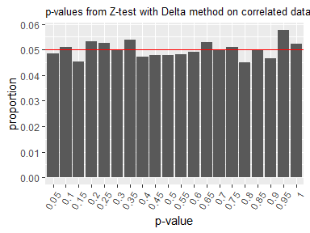

<!-- README.md is generated from README.Rmd. Please edit that file -->

# deltatest: Statistical Hypothesis Testing Using the Delta Method for Online A/B Testing

<!-- badges: start -->

[](https://github.com/hoxo-m/deltatest/actions/workflows/R-CMD-check.yaml)
<!-- badges: end -->

## 1. Overview

In online A/B testing, we often face a significant practical challenge:
the randomization unit differs from the analysis unit. Typically,
control and treatment groups are assigned at the user level, while
metrics—such as click-through rate—are measured at a finer level (e.g.,
per page view). In this scenario, the randomization unit is user, while
the analysis unit is page-view.

This discrepancy raises concerns for statistical hypothesis testing,
which assumes that data points are independent and identically
distributed (i.i.d.). Specifically, a single user can generate multiple
page views, and each user may have a different probability of clicking.
As a result, the data may exhibit within-user correlation, thereby
violating the i.i.d. assumption.

When the standard Z-test is applied to such correlated data, the
resulting p-values do not follow the expected uniform distribution under
the null hypothesis. As a result, smaller p-values tend to occur more
frequently despite there being no true difference, increasing the risk
of falsely detecting a significant difference.


To address this issue, Deng et al. (2018) proposed a statistical
hypothesis testing method. It replaces the standard variance estimation
formula in the Z-test with an approximate formula using the Delta method
which can account for within-user correlation. This package has been
developed to make it easy to execute that method.

First, we prepare a data frame that includes the number of clicks and
page views aggregated for each user. This data frame also contains a
column indicating whether each user was assigned to the control or
treatment group.

``` r
library(dplyr)

n_user <- 2000

set.seed(314)
data <- deltatest::generate_dummy_data(n_user) |> 
  mutate(group = if_else(group == 0, "control", "treatment")) |>
  group_by(user_id, group) |> 
  summarise(clicks = sum(metric), pageviews = n(), .groups = "drop")

data
#> # A tibble: 2,000 × 4
#>    user_id group     clicks pageviews
#>      <int> <chr>      <int>     <int>
#>  1       1 treatment      1         6
#>  2       2 treatment      2        11
#>  3       3 control        0        17
#>  4       4 control        4        12
#>  5       5 control        5        10
#>  6       6 control        1        15
#>  7       7 control        2         6
#>  8       8 treatment      2        11
#>  9       9 treatment      2        16
#> 10      10 control        0        17
#> # ℹ 1,990 more rows
```

To perform a statistical hypothesis test using the Delta method on this
data, as follows:

``` r
library(deltatest)

deltatest(data, clicks / pageviews, by = group)
#> 
#>  Two Sample Z-test Using the Delta Method
#> 
#> data:  clicks/pageviews by group
#> Z = 0.31437, p-value = 0.7532
#> alternative hypothesis: true difference in means between control and treatment is not equal to 0
#> 95 percent confidence interval:
#>  -0.01410593  0.01949536
#> sample estimates:
#>   mean in control mean in treatment        difference 
#>       0.245959325       0.248654038       0.002694713
```

The Z-test using the Delta method yields p-values that follow the
expected uniform distribution under the null hypothesis, even in the
presence of correlation within the data.



## 2. Installation

You can install the development version of deltatest from
[GitHub](https://github.com/) with:

``` r
# install.packages("remotes")
remotes::install_github("hoxo-m/deltatest")
```

## 3. Details

### 3.1 Basic Usage

The **deltatest** package provides the `deltatest` function to perform
the statistical hypothesis testing using the Delta method, as proposed
by Deng et al. (2018).

To run `deltatest`, you need to prepare a data frame. It must include
columns for the numerator and denominator of your metric, aggregated by
each randomization unit (typically, the randomization unit is a user).
For example:

- If the metric is CTR, the numerator is the number of clicks, and the
  denominator is the number of page views.
- If the metric is CVR, the numerator is the number of converted
  sessions, and the denominator is the number of sessions.

The `generate_dummy_data` function provides

``` r
library(dplyr)

n_user <- 2000

data <- deltatest::generate_dummy_data(n_user) |>
  group_by(user_id, group) |>
  summarise(clicks = sum(metric), pageviews = n(), .groups = "drop")

data
#> # A tibble: 2,000 × 4
#>    user_id group clicks pageviews
#>      <int> <int>  <int>     <int>
#>  1       1     1      7        39
#>  2       2     1     12        20
#>  3       3     1      1        14
#>  4       4     1     15        23
#>  5       5     1      1        26
#>  6       6     0      1         7
#>  7       7     1      1        12
#>  8       8     1      0        24
#>  9       9     0      4        11
#> 10      10     1      0        10
#> # ℹ 1,990 more rows
```

### 3.2 Expression Styles

1.  Expression (NSE; non-standard evaluation)

``` r
deltatest(data, clicks / pageviews, by = group)
```

2.  Standard formula

``` r
deltatest(data, clicks / pageviews ~ group)
```

3.  Lambda formula

``` r
deltatest(data, ~ clicks / pageviews, by = group)
```

- With calculation (for all styles)

``` r
deltatest(data, pos / (pos + neg), by = group)
```

### 3.3 Information

## 4. Related Work

- [tidydelta: Estimation of Standard Errors using Delta
  Method](https://cran.r-project.org/package=tidydelta)

## 5. References

- Deng, A., Knoblich, U., & Lu, J. (2018). Applying the Delta Method in
  Metric Analytics: A Practical Guide with Novel Ideas. *Proceedings of
  the 24th ACM SIGKDD International Conference on Knowledge Discovery &
  Data Mining.*
  [doi:10.1145/3219819.3219919](https://doi.org/10.1145/3219819.3219919)
- Deng, A., Lu, J., & Litz, J. (2017). Trustworthy Analysis of Online
  A/B Tests: Pitfalls, challenges and solutions. *Proceedings of the
  Tenth ACM International Conference on Web Search and Data Mining.*
  [doi:10.1145/3018661.3018677](https://doi.org/10.1145/3018661.3018677)
- id:sz_dr (2018). Calculating the mean and variance of the ratio of
  random variables using the Delta method \[in Japanese\]. *If you are
  human, think more now.*
  <https://www.szdrblog.info/entry/2018/11/18/154952>
